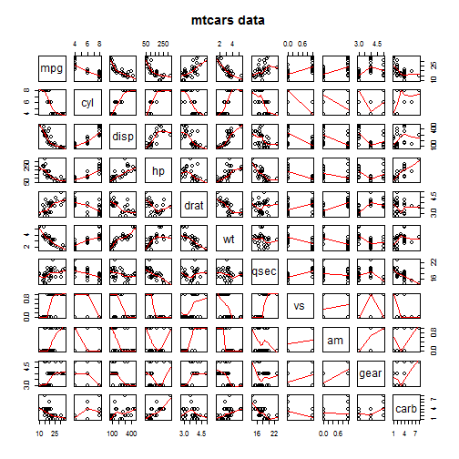

## Introduction

This presents a multivariable regression example using R. We will use the "mtcars" data to analyze the imporant factor that affets the "miles per gallon".


```r
library(datasets); data(mtcars); require(stats); require(graphics)
summary(lm(mpg~disp+hp+wt,data=mtcars))$coefficients
```

```
##                  Estimate Std. Error     t value     Pr(>|t|)
## (Intercept) 37.1055052690 2.11081525 17.57875558 1.161936e-16
## disp        -0.0009370091 0.01034974 -0.09053451 9.285070e-01
## hp          -0.0311565508 0.01143579 -2.72447633 1.097103e-02
## wt          -3.8008905826 1.06619064 -3.56492586 1.330991e-03
```

--- .class #id 

## Summary of data

```r
summary(lm(mpg~disp+hp+wt,data=mtcars))
```

```
## 
## Call:
## lm(formula = mpg ~ disp + hp + wt, data = mtcars)
## 
## Residuals:
##    Min     1Q Median     3Q    Max 
## -3.891 -1.640 -0.172  1.061  5.861 
## 
## Coefficients:
##              Estimate Std. Error t value Pr(>|t|)    
## (Intercept) 37.105505   2.110815  17.579  < 2e-16 ***
## disp        -0.000937   0.010350  -0.091  0.92851    
## hp          -0.031157   0.011436  -2.724  0.01097 *  
## wt          -3.800891   1.066191  -3.565  0.00133 ** 
## ---
## Signif. codes:  0 '***' 0.001 '**' 0.01 '*' 0.05 '.' 0.1 ' ' 1
## 
## Residual standard error: 2.639 on 28 degrees of freedom
## Multiple R-squared:  0.8268,	Adjusted R-squared:  0.8083 
## F-statistic: 44.57 on 3 and 28 DF,  p-value: 8.65e-11
```

--- .class #id 

## The regression

```r
pairs(mtcars,panel=panel.smooth,main='mtcars data')
```

 


--- .class #id 

## Multilevel factor
Except the "miles per gallon", there might exsits some relationship among the left items, we consider a multilevel factor level. We guess that the "drat" and "qsec" might are linear dependent on "disp", "hp", and "wt".
So, we need the 2 levels.

$$Y_1=\beta_{10}+\beta_{11}X_{1}+\beta_{12}X_2+\beta_{13}X_3,$$
$$Y_2=\beta_{20}+\beta_{21}X_{1}+\beta_{22}X_2+\beta_{23}X_3,$$
where 

1. $Y_1$ is "drat", $Y_2$ is "qsec";

2. $X_{1}$ is "disp", $X_{2}$ is "hp", $X_{3}$ is "wt";

3. $\beta_{ij}$ are the coefficients.

